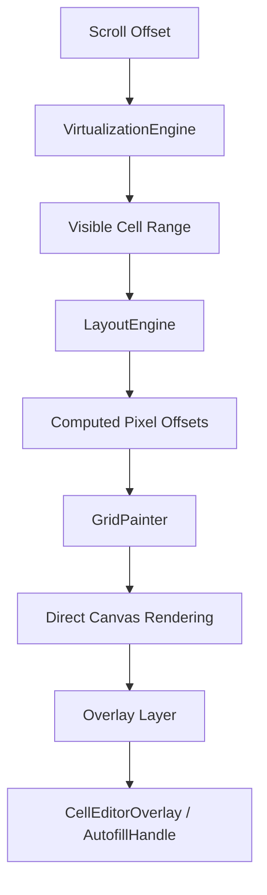
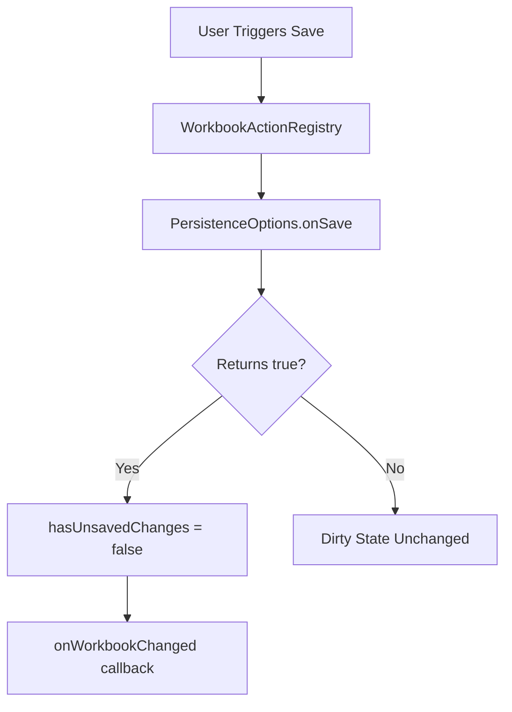

# Architecture: The Sheetifye Engine

> Sheetifye is a production-grade **Flutter spreadsheet engine** built on a layered, canvas-first architecture optimized for rendering performance, predictable state, and long-term extensibility.

---

## Technical Philosophy

Most Flutter data grids suffer performance bottlenecks on large datasets because they create one widget per cell. Sheetifye takes a different approach: **Direct Canvas Painting**.

By bypassing the widget tree for individual cells, we eliminate build and layout overhead for thousands of cells per frame, achieving **60+ FPS** on entry-level devices regardless of workbook size.

Every mutation — from a single character edit to a multi-range paste — flows through the **command pattern**, giving undo/redo and dirty-state tracking as first-class features.

---

## Directory Structure

```
lib/src/
├── domain/         Pure entities — Workbook, Sheet, Cell, CellRange, MergedRegion
├── data/
│   ├── adapters/   XLSX parser (archive + xml), CSV adapter
│   ├── persistence/ WorkbookSerializer (JSON), WorkbookExporter (CSV, XLSX bytes)
│   └── sources/    AssetSource, FileSource, MemorySource, NetworkSource
├── engine/
│   ├── autofill/   AutofillEngine — pattern detection and range fill
│   ├── clipboard/  ClipboardManager — in-app + system TSV, formula shifting
│   ├── formula/    Tokenizer + Evaluator (AST), dependency graph
│   ├── overlays/   OverlayManager, CellEditorOverlay, AutofillOverlayLayer
│   ├── scrolling/  Scroll controller coordination
│   ├── selection/  Selection state machine
│   └── structure/  ReferenceShiftEngine — formula address rewriting on paste
├── features/
│   ├── actions/    WorkbookActionRegistry, WorkbookAction model, adaptive menu widget
│   ├── formula_bar/ Formula bar widget
│   ├── grid/       SheetGrid painter + gesture detector
│   ├── search/     In-sheet search
│   ├── tabs/       Sheet tab bar
│   ├── toolbar/    Adaptive toolbar (mobile / desktop)
│   └── workbook/   SheetifyeWorkbook widget, WorkbookState (Riverpod)
├── core/           Theme, SheetifyeThemeData, GridUtils, layout math
└── public/         Sheetifye widget, WorkbookExporter, PersistenceOptions
```

---

## Rendering Pipeline

When the scroll position changes, the engine executes a multi-stage pipeline:



1. **VirtualizationEngine** — Identifies which rows and columns intersect the viewport, skipping all others entirely.
2. **LayoutEngine** — Computes pixel-perfect sizes and offsets, accounting for merged cells and custom row/column dimensions.
3. **GridPainter** — A `CustomPainter` that draws grid lines, cell backgrounds, borders, and text in a single `Canvas` pass.
4. **OverlayManager** — Renders editor overlays and autofill handles above the canvas layer, managed independently of the grid paint cycle.

---

## Editing Pipeline

When a user activates cell editing:


- The `CellEditorOverlay` is an absolutely-positioned `TextField` rendered above the canvas.
- Input is committed as an `EditCommand` which the `WorkbookController` pushes onto the undo/redo stack.
- The formula dependency graph triggers re-evaluation of all cells that reference the mutated cell.

---

## State Management

Sheetifye uses **Riverpod** for reactive, predictable state flow.

| Provider | Responsibility |
|:---|:---|
| `workbookProvider` | The active `WorkbookState` — workbook data, selection, dirty flag |
| `persistenceOptionsProvider` | Lifecycle callbacks (`onSave`, `onSaveAs`, `onBeforeClose`, `onDiscardChanges`) |
| `customWorkbookActionsProvider` | Developer-injected `WorkbookAction` list |

`WorkbookState` is immutable. All mutations produce a new state via `copyWith`, enabling efficient `ref.listen` diffing.

---

## Persistence System



### Dirty State Tracking

`WorkbookState.hasUnsavedChanges` becomes `true` when:
- A cell is edited (any `EditCommand` pushed)
- An undo or redo changes the workbook content

It becomes `false` when:
- `onSave` or `onSaveAs` returns `true`
- The workbook is reloaded from source

### Close Interception

When `onBeforeClose` is provided, back-navigation and window-close events are intercepted. The callback receives control; return `false` to cancel navigation (allowing you to show a save dialog first).

---

## Clipboard Engine

The `ClipboardManager` implements two paste modes:

| Mode | Trigger | Behavior |
|:---|:---|:---|
| **In-App** | Copy from within Sheetifye | Preserves the cell range with formula reference shifting |
| **System** | Paste from Excel, Sheets, etc. | Parses RFC-4180 TSV from the system clipboard |

**Formula Shifting** uses the `ReferenceShiftEngine` to rewrite relative cell addresses (`A1`, `B2:C4`) by the row/column paste offset, matching Excel's paste behavior.

---

## Formula Engine

```mermaid
graph LR
    A[Raw Input "=SUM(A1:A10)*B2"] --> B[Tokenizer]
    B --> C[Token Stream]
    C --> D[AST Builder]
    D --> E[Expression Tree]
    E --> F[Evaluator]
    F --> G[Dependency Lookup]
    G --> H[Computed Result]
```

- **Tokenizer** — Scans the raw formula string into typed tokens (operators, references, functions, literals).
- **Evaluator** — Walks the AST recursively, resolving cell references against the live workbook state.
- **Dependency Graph** — Tracks which cells a formula depends on. When a dependency changes, only affected formulas are re-evaluated.

---

## Autofill Engine

The `AutofillEngine` detects fill patterns when the user drags the autofill handle:

| Input | Detected Pattern | Fill Behavior |
|:---|:---|:---|
| `1, 2, 3` | Arithmetic +1 | `4, 5, 6, …` |
| `Jan, Feb` | Month sequence | `Mar, Apr, …` |
| `"Draft"` | Repeating text | Repeat value |
| `=A1+1` | Formula | Shift references |

---

## Action System

The `WorkbookActionRegistry` aggregates built-in and developer-injected actions:

```dart
// Developer injects via the customActions parameter:
WorkbookAction(
  id: 'app.export',
  label: 'Export to PDF',
  icon: Icons.picture_as_pdf,
  group: WorkbookActionGroup.file,
  isEnabled: (state) => !state.hasUnsavedChanges,
  onExecute: (context, ref) async { /* … */ },
)
```

The `WorkbookActionMenuButton` renders adaptively:
- **Mobile** — `showModalBottomSheet` with grouped sections
- **Desktop / Web** — `showMenu` popup at the button position

---

## Mobile / Desktop Adaptive UX

| Interaction | Mobile | Desktop / Web |
|:---|:---|:---|
| **Cell activation** | Double-tap | Double-click or Enter/F2 |
| **Action menu** | Bottom sheet | Popup menu |
| **Keyboard** | System soft keyboard | Physical keyboard |
| **Selection** | Touch drag | Click + Shift/Ctrl drag |
| **Scroll** | Finger scroll | Mouse wheel / trackpad |

---

## Testing Infrastructure

The test suite uses `flutter_test` with `ProviderContainer` for isolated Riverpod state:

| Layer | Count | Notes |
|:---|:---:|:---|
| Engine unit tests | 17 dirs | Pure domain/engine logic, no Flutter widgets |
| Widget tests | 5 | `WidgetTester` with `ProviderScope` overrides |
| Integration tests | 5 | Full widget trees, simulated platform gestures |

```bash
fvm flutter test          # run all 324 tests
fvm flutter analyze       # zero issues enforced
```

---

<sub>This document reflects the architecture as of **Sheetifye v1.1.0**.</sub>