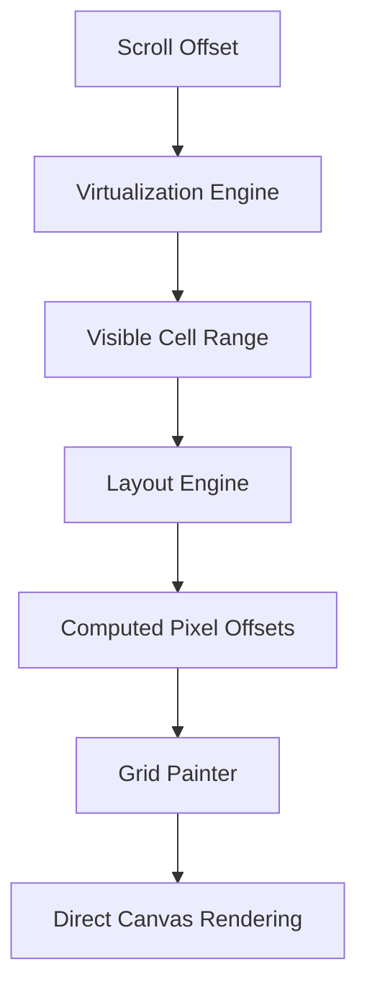

# Architecture: The Sheetifye Engine

> Sheetifye is a high-performance **spreadsheet platform** for the Flutter ecosystem, built on a refined monolithic architecture optimized for rendering speed, predictable state, and long-term extensibility.

---

## Technical Philosophy

Most data grids in Flutter suffer from performance bottlenecks when handling large datasets because they rely on standard `ListView` or `GridView` widgets for every cell. Sheetifye takes a different approach: **Direct Canvas Painting**.

By bypassing the widget tree for individual cells, we reduce the overhead of build and layout phases, achieving **60+ FPS** even on entry-level devices with millions of cells.

---

## Directory Structure

```
lib/src/
├── domain/       # Pure entities — Workbook, Sheet, Cell, CellRange
├── engine/       # Runtime systems — Formula, Render, Layout, Selection
├── features/     # UI components and Riverpod-based state controllers
└── core/         # Shared utilities, theme constants, and extensions
```

---

## Rendering Pipeline

When the scroll position changes, the engine executes a multi-stage pipeline:



1.  **VirtualizationEngine**: Identifies exactly which rows and columns are within the viewport.
2.  **LayoutEngine**: Computes pixel-perfect sizes and offsets, accounting for merged cells and custom row/column dimensions.
3.  **GridPainter**: A custom `Painter` that draws the grid lines, cell backgrounds, and text directly to the `Canvas` in a single pass.

---

## State Management

Sheetifye leverages **Riverpod** for a reactive, yet predictable state flow. The `WorkbookController` serves as the orchestrator:

-   **Mutations**: All edits and formatting changes are handled via a command pattern, enabling built-in undo/redo capabilities.
-   **Selection**: A dedicated selection system handles single-cell, multi-cell, and range selections with high precision.
-   **Dependency Graph**: Tracks cell relationships to ensure that when a value changes, only the dependent cells are marked for re-evaluation.

---

## Extensibility

The engine is designed to be "pluggable," allowing developers to extend functionality without modifying the core:

| Extension Point | Description |
|:---|:---|
| **Custom Renderers** | Define how specific cells are painted (e.g., custom icons or graphs). |
| **Formula Plugins** | Add custom business logic functions to the formula engine. |
| **Overlay Layers** | Draw annotations, comments, or data validation hints above the grid. |

---

<sub>This document reflects the architecture as of **Sheetifye v1.0.0**. We are committed to maintaining a clean and performant codebase for the Flutter community.</sub>